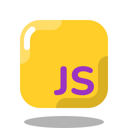

<h1 align="center"> 
Mirko Palackovic
</h1>

  

   Java Web Developer
  

<h3 align="center">
Technologies
</h3>

  
  
  
  

  
  
  

  
  

<h3 align="center">
Tools
</h3>

  
  

  
  

  
  

  
  

